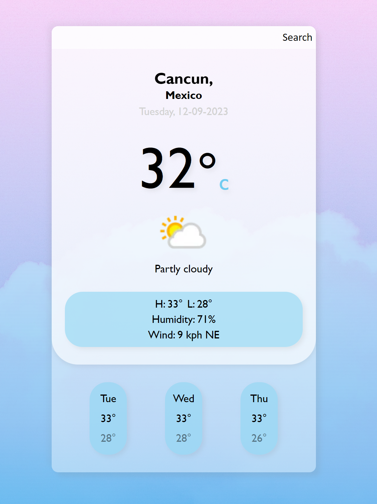

## What is this?

Modern minimalist app that lets you view the weather of cities around the world.

**New Features**\
Ability to switch between fahrenheit and celsius.

**Planned updates**\
Additional forecast data including but not limited to:\
Hourly forecast\
Chance of precipitation\
Sunrise and sunset\
Moon phase\
UV index\
***Addition future updates:***\
Integrate a city list API to give user suggestions when beginning to type into search bar

**Current Design**\

**Uses:** \
WeatherAPI.com\
Typescript\
Express\
Ejs\
Axios
